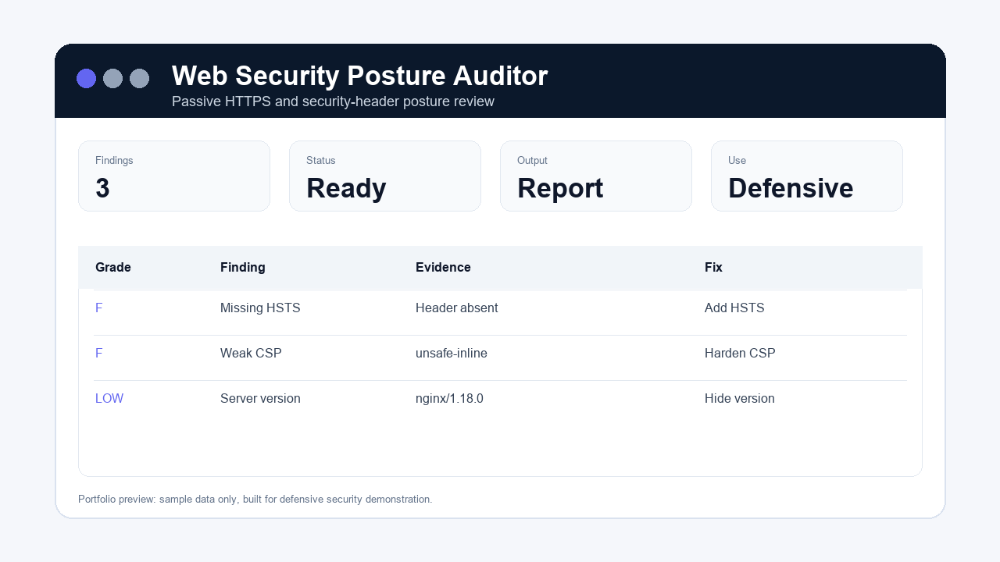

# Web Security Posture Auditor

  



Web Security Posture Auditor passively checks HTTPS usage and common security headers. It is designed for safe, authorized appsec review without crawling, fuzzing, or exploiting targets.

## Why Employers Like This

This project shows practical web security awareness: HTTPS, HSTS, CSP, clickjacking protection, MIME sniffing, referrer policy, and information disclosure.

## Features

- Audits live URLs or saved header JSON.
- Checks important security headers.
- Flags weak Content Security Policy patterns.
- Flags server version disclosure.
- Assigns a simple security grade.
- Generates a Markdown report.

## Example Report

See [docs/examples/example_web_security_report.md](docs/examples/example_web_security_report.md) for a rendered sample posture report.

## Quick Start

```bash
set PYTHONPATH=src
python -m web_security_posture_auditor.cli --headers-json sample_data/headers.json --url https://demo.local
python -m unittest discover -s tests -v
```

## Responsible Use

This is a passive header auditor. Only test websites you own or have permission to assess.